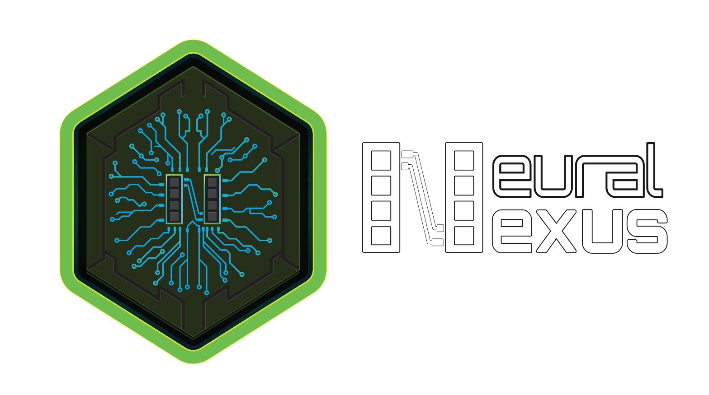

  

# 🧠 Neural Nexus: Universal AI Memory Protocol (NNMP)

**Neural Nexus** is a professional-grade, framework-agnostic long-term memory system. It provides a centralized, secure "brain" for AI agents, decoupling memory from specific LLMs or frameworks and making it accessible via a unified architecture.

---

## 🚀 Core Pillars

- **Robust Hybrid Search**: Merges semantic vector similarity with keyword precision using Reciprocal Rank Fusion (RRF).
- **Temporal Relevance**: A mathematically sound Decay Engine that adjusts memory importance based on time and usage.
- **Privacy & Multi-Tenancy**: Built-in isolation per user, ensuring data sovereignty and security.
- **Universal Ecosystem**: Native support for MCP, OpenAI Proxy, Telegram, CLI, and custom SDKs.

---

## 📚 Documentation Hub

Every aspect of Neural Nexus is documented in detail within the **[docs/](./docs)** directory:

### 🛠️ Getting Started
- **[Exhaustive Setup Guide](./docs/setup.md)**: Hardware/software prerequisites, installation, and first-run instructions.
- **[Troubleshooting](./docs/troubleshooting.md)**: Common issues, connection fixes, and native module solutions.

### 🔌 Integration & Usage
- **[Quick Step-by-Step Guide](./docs/steps.md)**: Numbered instructions for all 5 connection methods.
- **[Model Connection Guide](./docs/integrations.md)**: Detailed steps for OpenAI Proxy, MCP Server, Ollama, Claude, and more.
- **[API Reference](./docs/api.md)**: Standardized REST endpoints for recall, storage, and administration.
- **[TypeScript SDK](./packages/nexus-js)**: Integration for Node.js and Web applications.

### 🧠 The Standard
- **[Protocol Specification](./docs/protocol.md)**: The formal rules of the NNMP v1.1 interface.
- **[Core Logic & Features](./docs/features.md)**: Breakdown of RRF, Semantic Deduplication, and the Decay Engine.
- **[Technical Audit](./docs/technical_audit.md)**: Deep-dive into the singleton architecture and system design.

### 📈 Project
- **[Change History](./docs/change_history.md)**: Development milestones and architectural evolution.

---

## ⚖️ License
**Neural Nexus Universal License (Personal & Non-Commercial)**
Free for personal, educational, and internal use. Commercial use or redistribution as a service requires written consent. See `LICENSE.md` for details.
